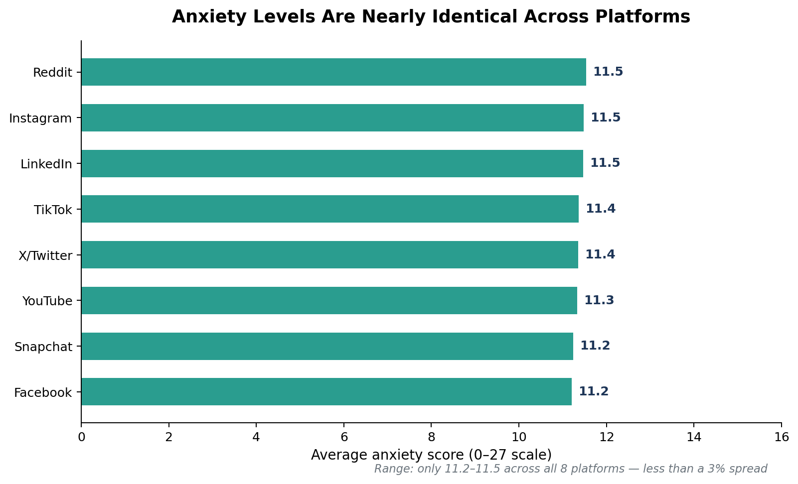
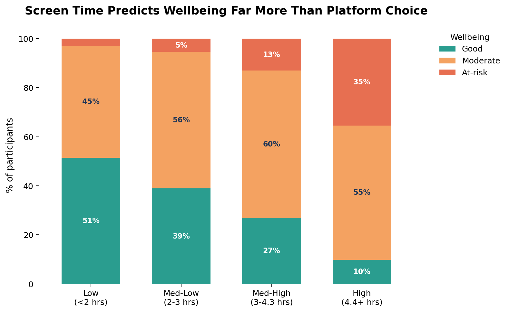
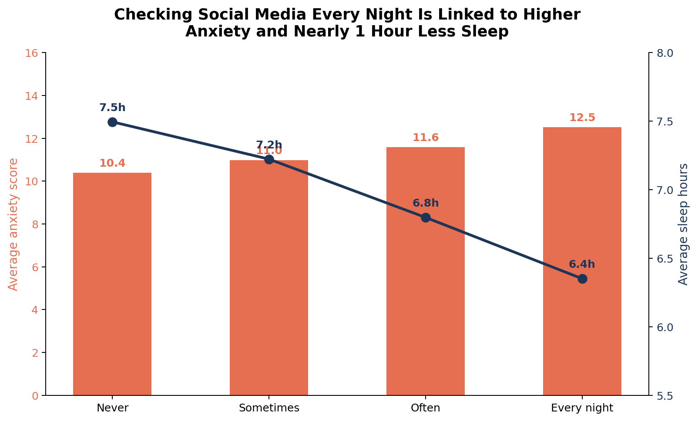

# It's Not the App — It's the Hours and the Hour of Day

**A data analysis of 7,000 social media users on screen time, platform choice, and mental health**

## The question I set out to answer

Everyone blames specific apps for the "social media mental health crisis" — TikTok gets singled out most often, Instagram close behind. I wanted to test that assumption against real data: does the *platform* actually predict worse mental health outcomes, or is something else driving the effect?

## Dataset

7,000 participants across 8 platforms (TikTok, Instagram, YouTube, X/Twitter, Facebook, Snapchat, Reddit, LinkedIn), with self-reported screen time, notification volume, nighttime usage habits, and validated-style mental health measures (anxiety, low mood, loneliness, self-esteem, FOMO, social comparison, sleep, and an overall wellbeing classification).

## Finding 1: Platform choice is a weak predictor

Average anxiety score by primary platform ranges from **11.2 to 11.5** on a 0–27 scale — a spread of less than 3%. Reddit and Instagram users report marginally higher anxiety than Facebook or Snapchat users, but the gap is small enough that it's not a meaningful driver on its own. "At-risk" wellbeing rates tell the same story: 13.1% (YouTube) to 16.8% (LinkedIn) — a narrow band, not a dramatic split.

**Takeaway:** if platform were the main driver, we'd expect a much wider spread. We don't see one.

## Finding 2: Screen time is a much stronger predictor

When I split users into quartiles by daily screen hours, the picture changes completely:

| Screen time | Avg anxiety | % "At-risk" | % "Good" |
|---|---|---|---|
| Low (<2 hrs) | 8.7 | 3.0% | 51.5% |
| Med-low (2–3 hrs) | 10.2 | 5.4% | 38.9% |
| Med-high (3–4.3 hrs) | 11.9 | 13.0% | 27.0% |
| High (4.4+ hrs) | 15.0 | 35.4% | 9.8% |

Daily screen hours correlates with anxiety at **r = 0.52** — one of the strongest relationships in the entire dataset, and far stronger than anything tied to platform choice. People in the highest screen-time bracket were **nearly 12x more likely** to be classified "At-risk" than people in the lowest bracket.

## Finding 3: When you check matters too

People who check social media every night report meaningfully worse outcomes than people who never do:

- **Anxiety:** 12.5 (every night) vs. 10.4 (never)
- **Sleep:** 6.35 hrs (every night) vs. 7.49 hrs (never) — over an hour of lost sleep
- **"At-risk" rate:** 18.8% (every night) vs. 10.9% (never)

Interestingly, *how quickly* someone checks their phone after waking barely moved any outcome — it's the nighttime habit, not the morning one, that carries the signal.

## What this means

The popular narrative — "app X is bad for your mental health" — oversimplifies what's actually happening. This data suggests the real risk factors are **behavioral**: total time spent, notification load, and nighttime use, not which app happens to be open. That's a more useful (and more actionable) framing, especially for anyone building digital wellbeing tools: intervention features that target *usage patterns* — screen time caps, night-mode nudges — are likely to matter more than platform-specific content moderation.

## Methodology notes

- All comparisons are on self-reported survey data — associations shown here are correlational, not causal proof that screen time *causes* anxiety (people already experiencing anxiety may also use their phones more).
- Anxiety and low mood scored 0–27; life satisfaction, loneliness, self-esteem, FOMO, and social comparison scored 1–10.
- Screen time quartiles were computed using pandas `qcut` for even group sizes.
- Analysis performed in Python (pandas, matplotlib). Full code: `analyze_screentime_mental_health.py`
